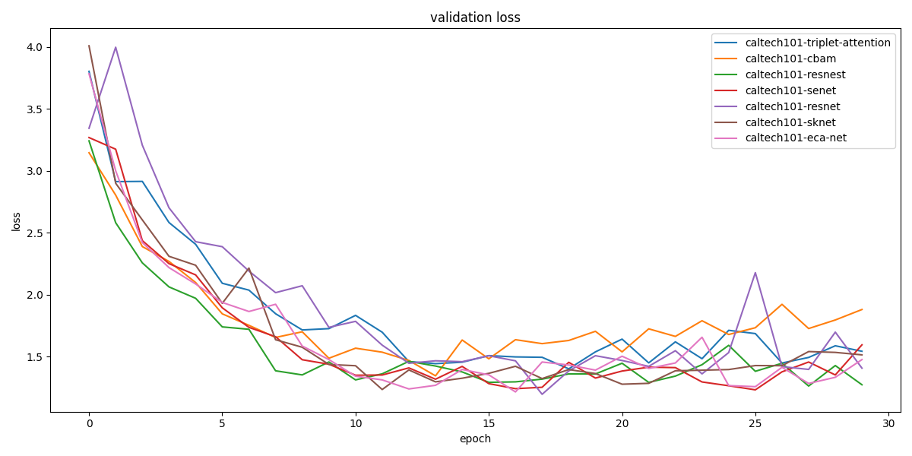

# 计算机视觉中的注意力机制

> 理论部分可以参考[我的博客](https://zhouchen.blog.csdn.net/article/details/111302952)，本项目选择其中很典型的注意力模型进行基础的分类任务的对比实验。

## 简介

在Caltech101和Caltech256上以ResNet50为基础添加各种注意力模块，对比其在基础的图像分类任务的效果。

## 环境配置

```
conda create -n attn python=3.6
conda install pytorch=1.6 cudatoolkit=10.2 torchvision
pip install -r requirements.txt
```

## 实验设计

|     模型名称                      |     GFLOPs    |     参数量     |
|-----------------------------------|---------------|----------------|
|     ResNet50                      |     4.110     |     24.035M    |
|     ResNet50+SE                   |     4.113     |     26.566M    |
|     ResNet50+CBAM                 |     4.122     |     26.551M    |
|     ResNet50+ECA                  |     4.116     |     24.035M    |
|     ResNet50+SK                   |     4.093     |     24.353M    |
|     ResNet50+Triplet Attention    |     4.110     |     24.035M    |
|     ResNeSt50                     |     5.399     |     25.961M    |

## 实验结果

Caltech101上训练集和验证集各模型的表现。


